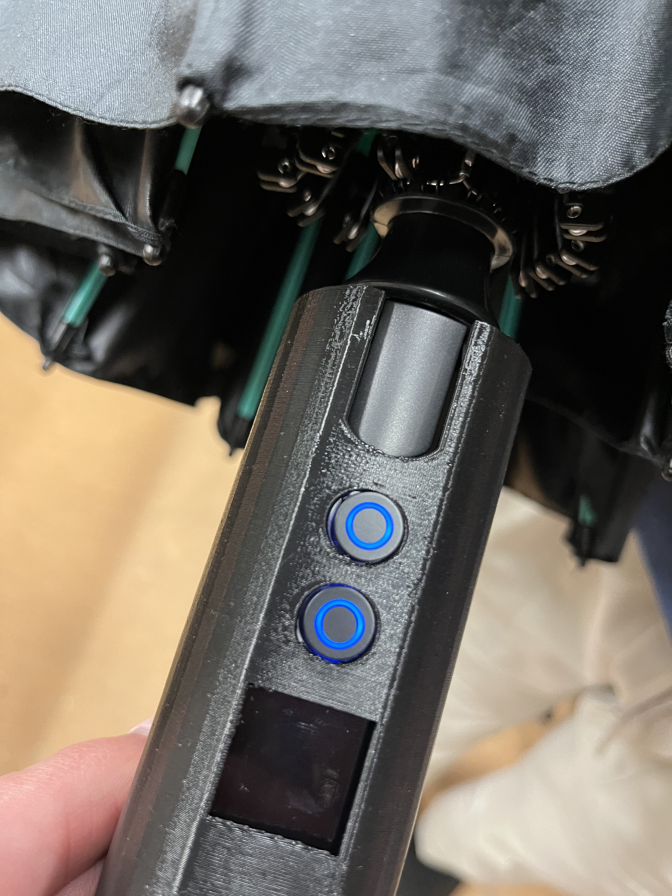
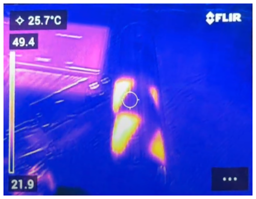
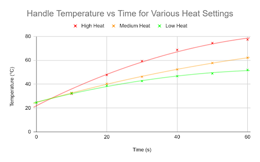
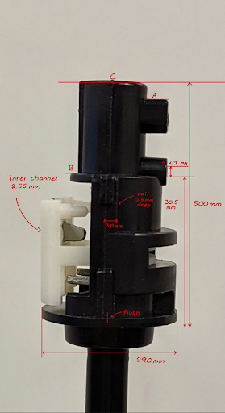
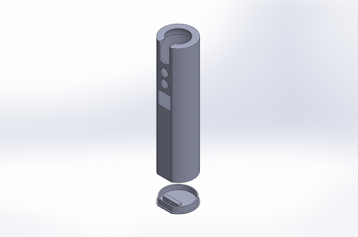
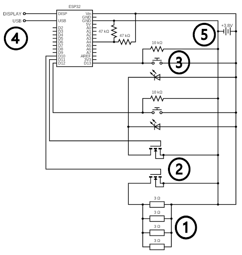
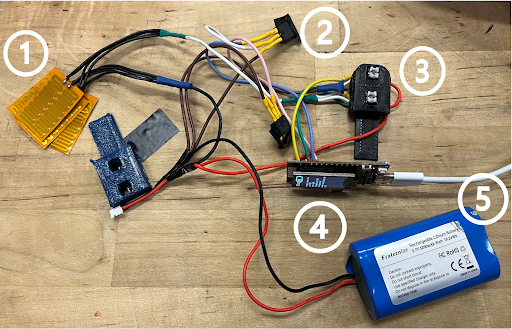

**For Those with Cold hands**

# ⚠ Page Under Construction ⚠

&nbsp;

&nbsp;

&nbsp;

*Handle Up-Close*

*Thermal Image*

*Thermal Test Results*

*Internal Mechanism*

*Handle CAD*

1. Four heating films
2. Two MOSFETs
3. Two LED buttons
4. Display integrated with ESP32 microcontroller
5. 18650 lithium-ion battery (1S2P)

*Circuit Schematic*

*Circuit*

