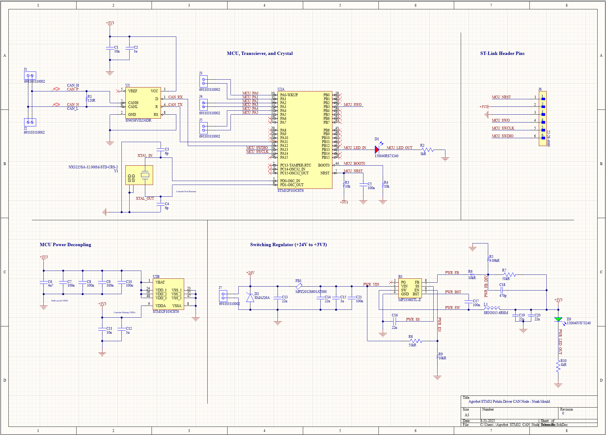
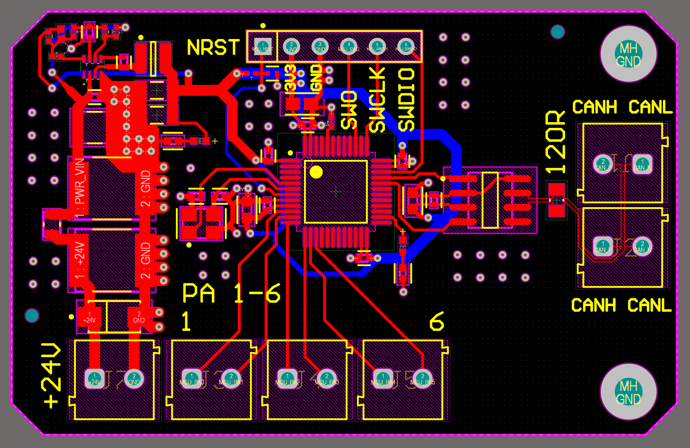
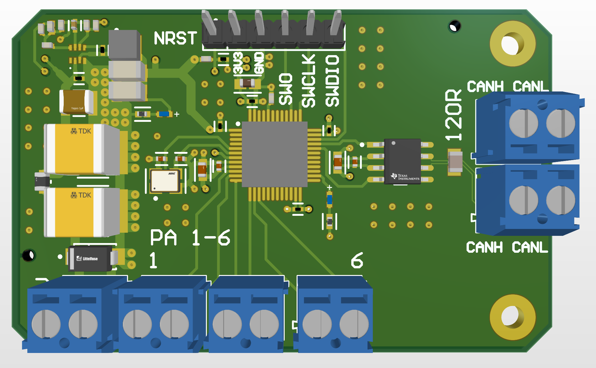

**Every Driver Deserves a Hat**

As part of [UBC’s Agrobot](https://ubcagrobot.com/) design team, I developed a custom PCB module for a robust, distributed motor control system. With the first hardware iteration now complete, this self-contained hat is built around an STM32 microcontroller and is designed to interface directly with the selected [Pololu G2 High-Power Motor Driver](https://www.pololu.com/product/2995). In this architecture, each of the robot's wheels is assigned its own intelligent controller, creating a modular, automotive-inspired CAN network that simplifies wiring and allows for scalable control.

### Project Motivation

The primary goal is to decentralize motor control, replacing complex point-to-point wiring with a scalable and robust CAN bus network. This architecture allows each motor to be addressed and commanded independently, improving system modularity. Furthermore, each node is designed to be self-sufficient by stepping down the main 24V motor supply to power its own logic circuits, which simplifies system-wide power distribution and reduces potential points of failure. Over time, this network will be expanded onto all of the onboard sensors and actuators.

### Technical Details

- **Core Microcontroller**: STM32F103C8T6, chosen for its native CAN controller, STM32 HAL library support, strong documentation ecosystem, and cost-effectiveness.

- **Network**: Automotive-style CAN network allows for scalable sensor and motor control on a single noise-resistant bus; per-wheel node topology. Secondary CAN terminals allows signal passthrough for intermediate nodes on the bus.

- **Power**: Integrated MP2338 high-efficiency synchronous switching regulator steps down the 24 V motor supply to 3.3 V logic, making each node fully self-contained.

- **Form Factor**: Will ultimately be designed as a hat to mount directly on the Pololu G2 High-Power Motor Driver, minimizing the physical footprint and connecting directly to the driver's logic pins for simplicity.

- **Connectors**: Standard SWD header for programming and testing, planned to be replaced by a more compact JTAG connector in future revisions. Two pairs of CAN terminals for passthrough. GPIO terminals to communicate with motor driver.

### Key Considerations for Future Iterations

- **Board Geometry**: The current board footprint does not align with the motor driver. The next version requires a revised PCB shape and layout to properly function as a "hat," requiring a perfect physical match to the motor driver and a more efficient use of space.

- **Connector Strategy**: Reposition and reselect connectors for more secure, direct, and intuitive interfacing with the motor driver.

- **Circuit Protection**: Add additional filtering (VDDA), CAN bus protections (common-mode choke, TVS diodes), and EMI safeguards.

- **Scalability**: A secondary, generalized variant of the node could be adapted for sensors actuators, and other peripherals beyond the four-wheel motors.

- **Debugging Interface**: Replace the bulky SWD header with a compact JTAG connector to reduce footprint and simplify design.

## 📸 Gallery  
 

*Schematic*

*Layout*

*PCB Render*