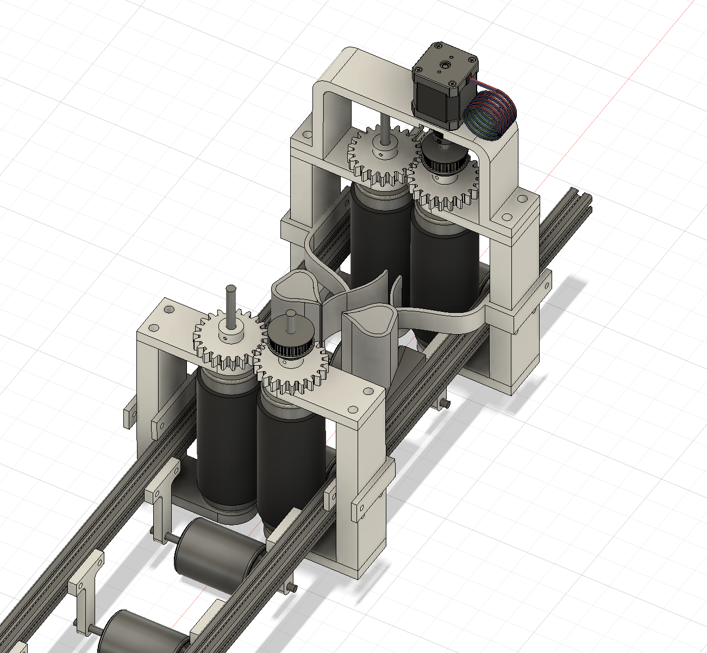
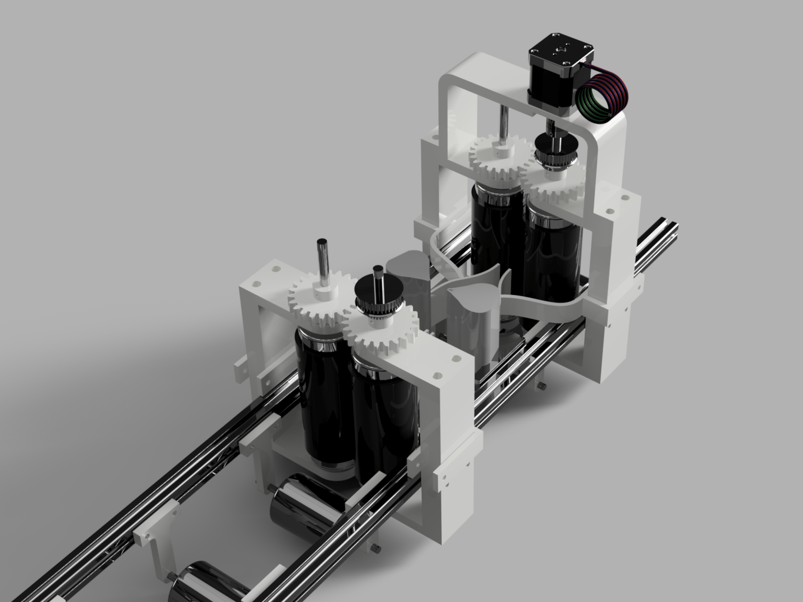
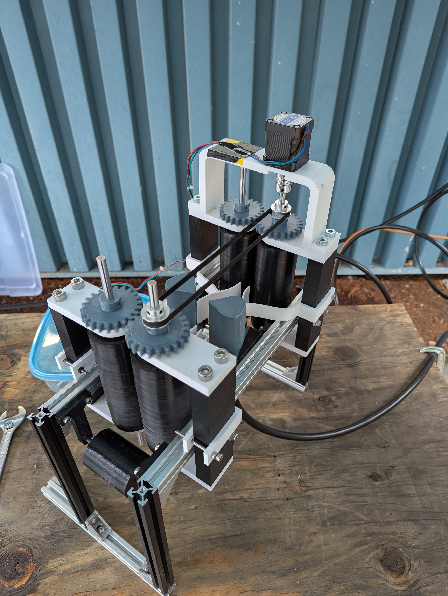

  <iframe 
    class="w-full h-full rounded-lg"
    src="https://www.youtube.com/embed/GQPv-4U7Et0" 
    title="YouTube video player" 
    frameborder="0" 
    allow="accelerometer; autoplay; clipboard-write; encrypted-media; gyroscope; picture-in-picture" 
    allowfullscreen>
  </iframe>

### Automated Air-Drying Machine for High-Current Copper Flex Lead Fabrication (TRIUMF)

During my co-op at TRIUMF, I noticed that a large amount of time and coordination was spent drying copper sheets during the fabrication of high-current flex leads used in experimental hardware. Each flex lead is built from many thin copper sheets that must be processed in sequence, and a significant amount of manual labour was spent these sheets alongside other steps. I designed and built a machine to automate this drying step, reducing labour and improving flexibility in when the work could be scheduled.

### Background and Motivation

Each copper flex lead is assembled from **110 individual copper sheets** to support currents of up to **2400 Amps**. For a full batch of **16 flex leads**, nearly **2000 sheets** are required. In practice, defects introduced during processing mean that closer to **3000 sheets** must be prepared.

Each sheet undergoes the following steps:

- Cutting to size (~4 s per sheet)  
- **Tinning**, where flux is applied and the sheet is dipped into a crucible of molten solder (~40 s per sheet)  
- Scrubbing to remove residual flux and prevent corrosion (~30 s per sheet)  
- **Drying** to prevent oxidation (~30 s per sheet)  

The tinning process takes the longest because flux must be applied, the sheet must be dipped, and slag must be cleared from the surface of the molten solder. After tinning, scrubbing and drying must be done immediately: residual flux can cause corrosion if not scrubbed, and moisture can lead to oxidation if the sheet is not dried promptly.

Because scrubbing and drying must occur back-to-back, the process typically requires three people working at the same time—one tinning, one scrubbing, and one drying. While this approach works, it is difficult to schedule three people to work synchronously for long periods, especially when each person has other tasks to complete.

Across approximately **3000 sheets**, drying alone accounts for roughly **25 hours of manual work**. I saw an opportunity to make this part of the process more flexible by removing the need for a dedicated person whose only task was drying.

### What I Did

- **Problem Identification**  
  Recognized that drying required a dedicated person working in parallel with tinning and scrubbing, which made the process difficult to schedule and tied up time that could be spent on other tasks.

- **Mechanical Design and CAD**  
  Designed an automated air-drying machine that allows cleaned sheets to be fed directly into the system by the person performing the scrubbing step. Although I typically work in SolidWorks, I chose Autodesk Fusion for this project to match the tools used by colleagues and because it was better suited for rapid design around McMaster-Carr components and 3D-printed parts.

- **Fabrication and Assembly**  
  Built the machine using aluminum extrusion, off-the-shelf hardware, and custom 3D printed components, with the goal of minimal complexity and fast integration into the existing workflow.

- **Execution Under Schedule Constraints**  
  Planned and designed the system to work on the first attempt to avoid delaying the project timeline. The machine functioned as intended without requiring iterative redesign.

### Outcomes

- Removed approximately **25 hours of manual drying work**
- Reduced the number of people required for the tin–scrub–dry sequence from **three to two**, making it easier to schedule work.
- Allowed drying to occur continuously without interrupting the scrubbing process.

## 📸 Gallery

**The images below show the CAD design and the completed air-drying machine.**

*Auto Sheet Dryer CAD Model*

*Auto Sheet Dryer Render*

*Auto Sheet Dryer*

