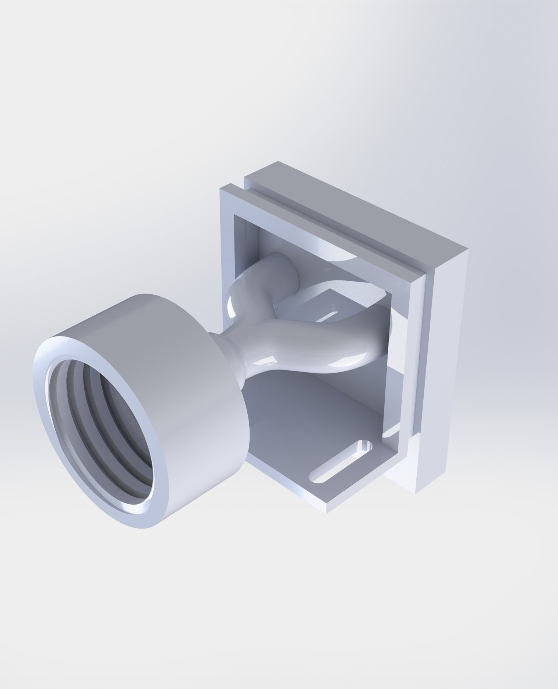
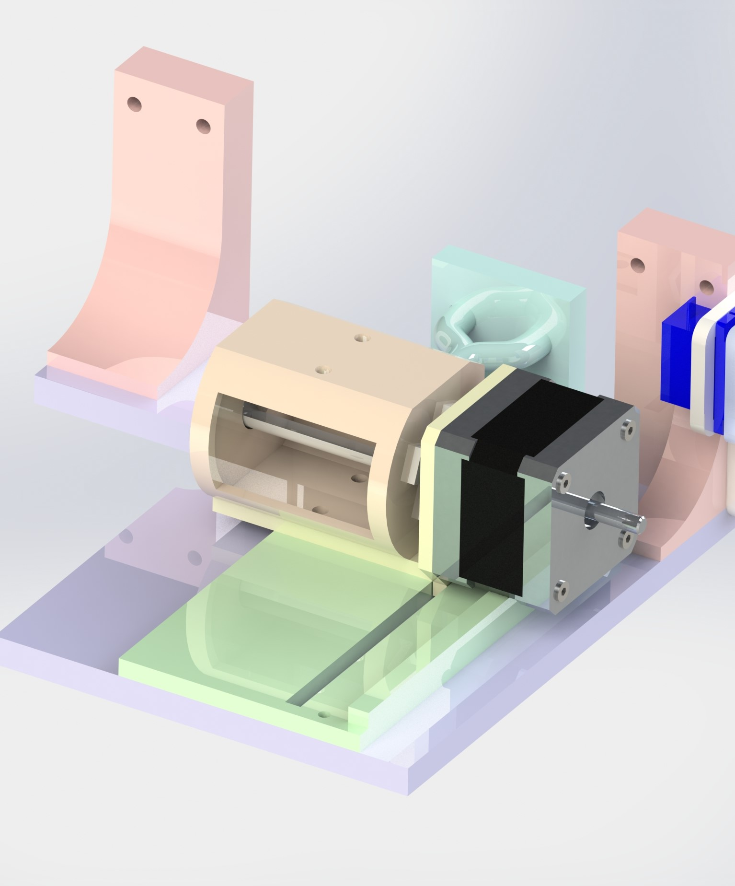
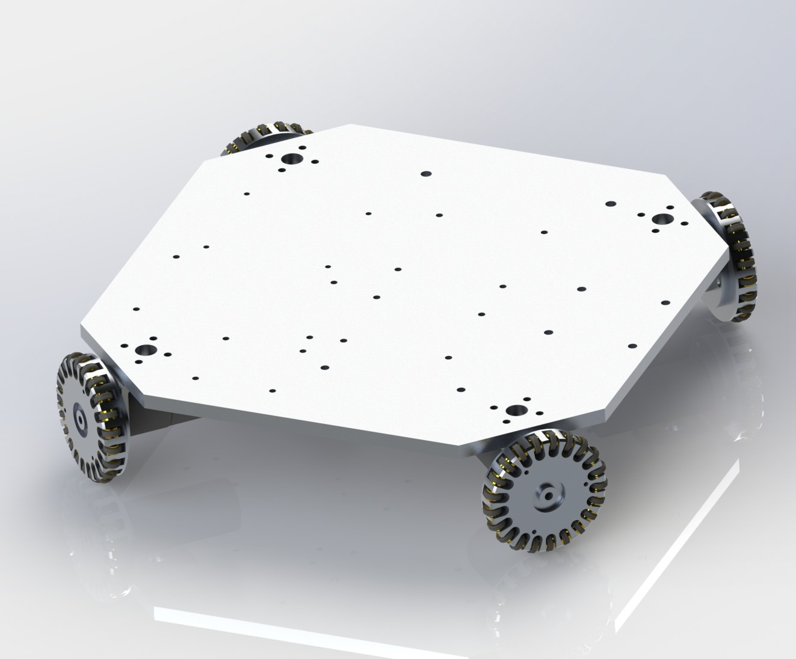
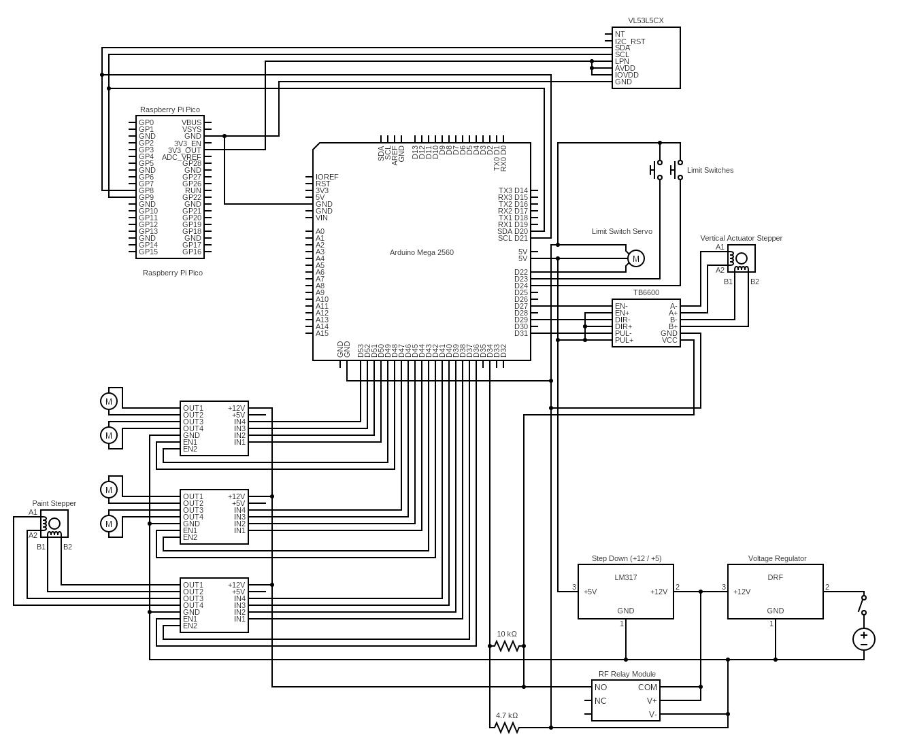
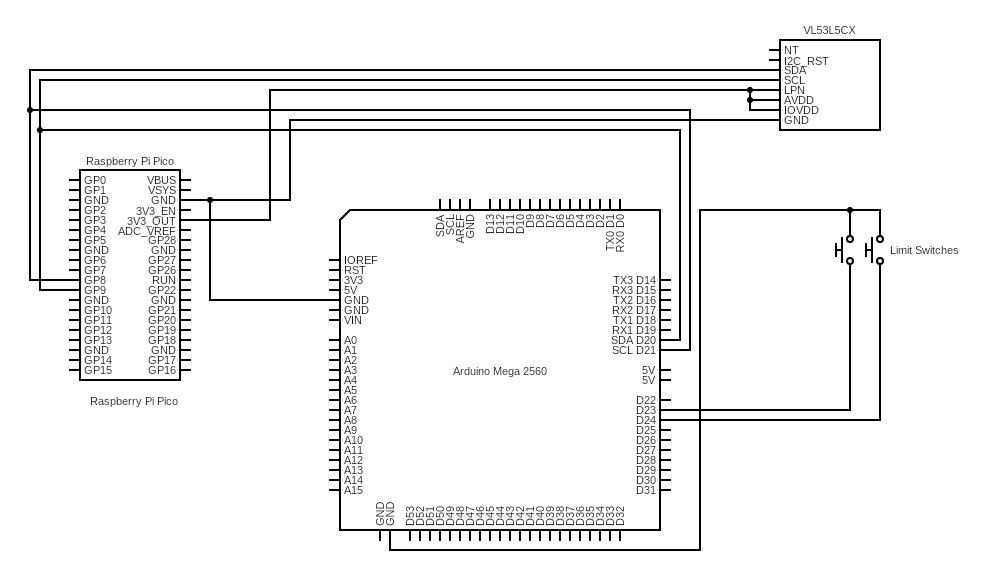
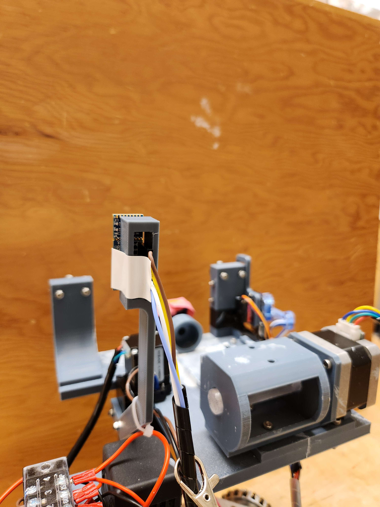
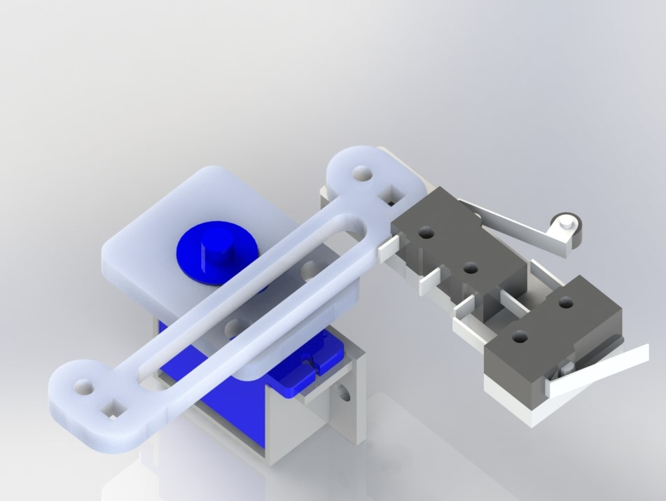
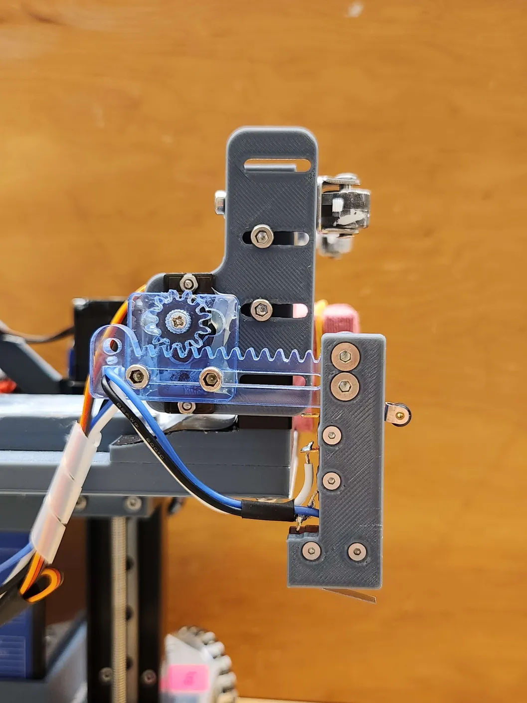
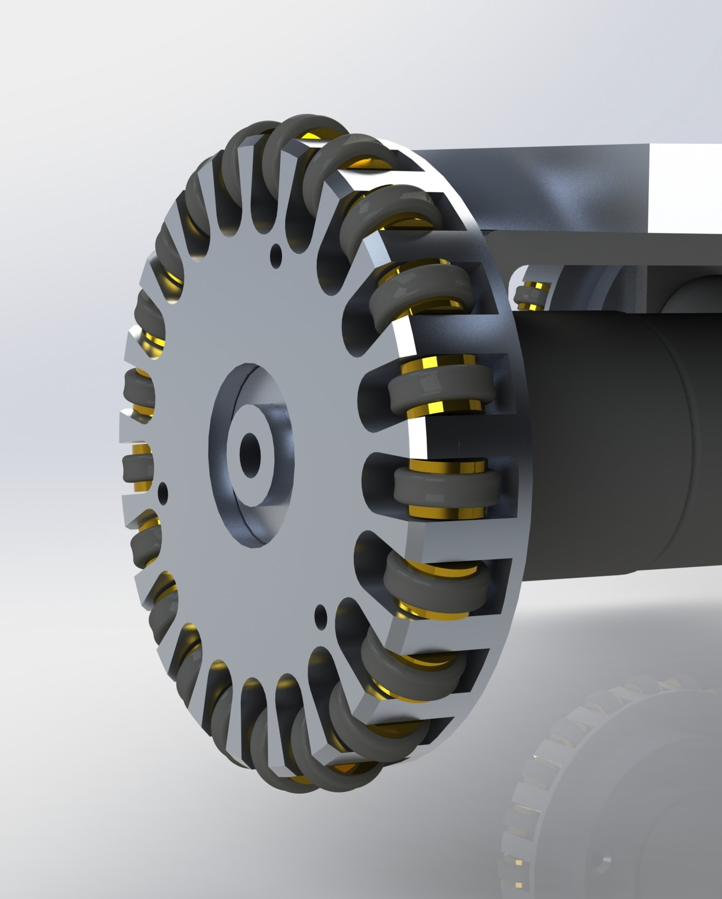
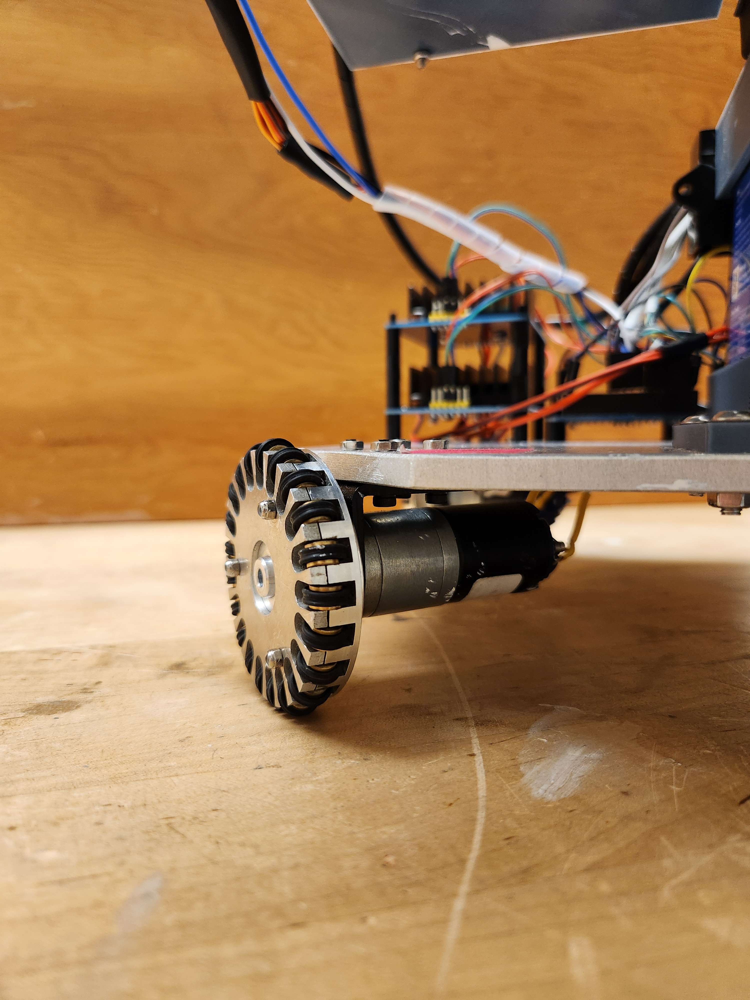

  <iframe 
    class="w-full h-full rounded-lg"
    src="https://www.youtube.com/embed/Ak9Btrw5SCo" 
    title="YouTube video player" 
    frameborder="0" 
    allow="accelerometer; autoplay; clipboard-write; encrypted-media; gyroscope; picture-in-picture" 
    allowfullscreen>
  </iframe>

### Autonomous Robot for Precision Wall Painting

I led the design, programming, and integration of an autonomous robot designed to paint a clean, uniform line above wall trim—one of the most tedious tasks in residential wall painting. This project was developed as part of a year-long engineering design course and required close collaboration across mechanical, electrical, and software subteams.

### Project Motivation

Amateur painters consistently cited “cutting” (painting the narrow strip above trim) as the most difficult and time-consuming part of the painting process. We set out to automate this task using a three-part robotic system that drives along a wall, detects trim height, and paints a precise 1.5-inch line.

### My Contributions

- **System Design & Integration**: I oversaw the integration of the robot’s three core systems—driving, sensing, and painting—and managed overall project direction.
- **CAD Modeling**: I was responsible for the final 3D models, including the paint applicator assembly, actuator mounts, custom sensor brackets, and flange-couple connectors.
- **Electrical Design**: I selected and wired all microcontrollers, sensors, actuators, and motor drivers. I also developed a robust power distribution system and created a complete system schematic.
- **Embedded Programming**: I programmed both the Arduino Mega and Raspberry Pi Pico, implementing I²C communication and logic for real-time wall alignment and painting control.
- **Testing & Troubleshooting**: I validated each subsystem independently and led final integration testing, including the feedback-based wall detection and actuator control loop.

### Key Features

- **Autonomous Wall Detection**: Uses a multi-zone ToF sensor and contact limit switches to identify wall distance, alignment, and trim height.
- **Precision Painting**: Paint is delivered from a squeezable silicone reservoir through a cloth-covered sponge to create clean, repeatable lines.
- **Modular Hardware**: All components mount to a robust aluminum drive base with adjustable linear actuators for vertical positioning.

### Outcomes

- Successfully painted clean, even lines above varying trim heights with minimal prep.
- Presented the working prototype at Design and Innovation Day.
- Demonstrated commercial feasibility in a rental-based business model.

## 📸 Gallary

**The images below show the CAD designs, wiring schematics, and individual completed sections of the robot.**

*Bottle Cap Dispenser Model*

*Paint Assembly Parts Model*

*Waterjet Cut Drivebase with Wheels*

*Full Circuit Schematic*

*Sensor Circuit Schematic*

*Mounted ToF Sensor*

*Servo-Switch Assembly Model*

*Servo-Switch Assembly*

*Wheel Model (model provided by external group)*

*Wheel Closeup (wheels provided by external group)*

